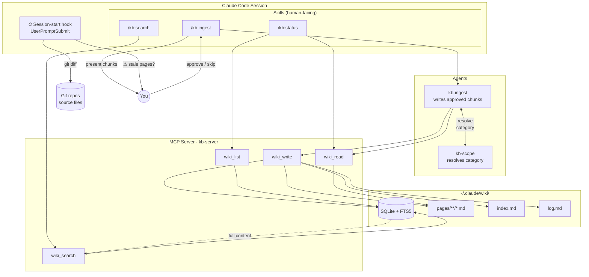

# ai-tools

Personal collection of Claude Code skills, agents, and MCP servers.

## Structure

```
skills/                      # Claude Code skills (invoked with /skill-name)
└── pr-deep-review/          # Deep PR review with DFS navigation table
└── kb-ingest/               # Interactively add a source to the KB
└── kb-search/               # Search the KB from any session
└── kb-status/               # Audit KB health and stale pages

agents/                      # Claude Code custom subagents
└── test-quality-reviewer.md # Test quality evaluation across 8 dimensions
└── kb-ingest.md             # Writes approved KB chunks, updates index and log
└── kb-scope.md              # Resolves KB category ambiguity

mcp/                         # MCP servers
└── kb-server/               # Knowledge base MCP server (wiki_search, wiki_read, wiki_write, wiki_list)
```

## KB Architecture



## Installation

Clone this repo anywhere on your machine, then symlink the artifacts into
Claude Code's lookup directories. Replace `<repo-root>` with the absolute
path where you cloned it.

### Skills (directories → symlink the directory)

```bash
ln -s <repo-root>/skills/<skill-name> ~/.claude/skills/<skill-name>
```

### Agents (single .md files → symlink the file)

```bash
mkdir -p ~/.claude/agents
ln -s <repo-root>/agents/<agent-name>.md ~/.claude/agents/<agent-name>.md
```

### Quick setup (all artifacts)

```bash
REPO=<repo-root>

# Skills
ln -s "$REPO/skills/pr-deep-review"  ~/.claude/skills/pr-deep-review
ln -s "$REPO/skills/kb-ingest"       ~/.claude/skills/kb-ingest
ln -s "$REPO/skills/kb-search"       ~/.claude/skills/kb-search
ln -s "$REPO/skills/kb-status"       ~/.claude/skills/kb-status

# Agents
mkdir -p ~/.claude/agents
ln -s "$REPO/agents/test-quality-reviewer.md"  ~/.claude/agents/test-quality-reviewer.md
ln -s "$REPO/agents/kb-ingest.md"              ~/.claude/agents/kb-ingest.md
ln -s "$REPO/agents/kb-scope.md"               ~/.claude/agents/kb-scope.md
```

Claude Code picks up new skills and agents automatically — no restart needed.

### MCP Server (kb-server)

Build the server:

```bash
cd mcp/kb-server && npm install && npm run build
```

Register in `~/.claude/mcp.json`:

```json
{
  "mcpServers": {
    "kb": {
      "command": "node",
      "args": ["<repo-root>/mcp/kb-server/dist/index.js"]
    }
  }
}
```

Register the staleness hook in `~/.claude/settings.json`:

```json
{
  "hooks": {
    "UserPromptSubmit": [
      "node <repo-root>/mcp/kb-server/dist/hooks/session-start.js"
    ]
  }
}
```

## Adding new artifacts

See `skills/pr-deep-review/README.md` and `agents/README.md` for the
conventions each artifact type follows.
