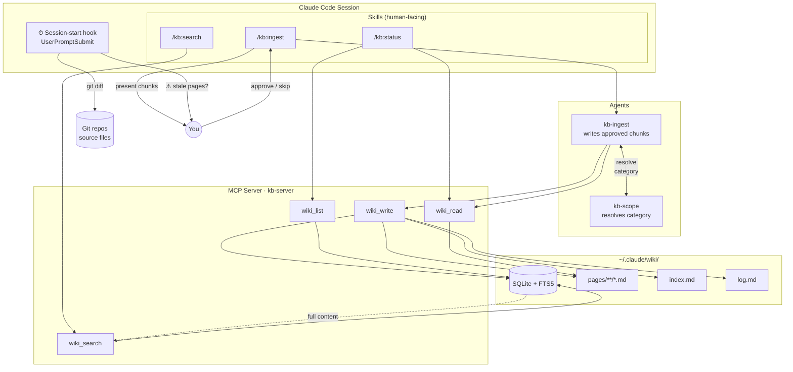

# Knowledge Base — Architecture

The KB system is a personal wiki that accumulates knowledge over time and makes it available to every Claude Code session. It follows Andrej Karpathy's LLM Wiki pattern: instead of raw retrieval-augmented generation, you maintain a curated set of wiki pages — distilled knowledge you've chosen to keep. Agents can read and write to it; humans control what goes in.

## Diagram

---

## Components

### Skills

Skills are instruction sets invoked with a `/` command inside a Claude Code session. They run in the main conversation context and drive the human interaction loop.

**`/kb:ingest`**
Adds a new source to the KB. Accepts a URL, file path, or pasted text. Claude reads the source and extracts candidate knowledge chunks, presenting them as a numbered list. You decide what to keep, skip, or reword before anything is written. Only after approval does the `kb-ingest` agent run and write pages.

**`/kb:search`**
Searches the KB by keyword. Calls `wiki_search` via the MCP server and displays ranked results. The top two results include full page content; the rest show snippets. Useful when you want to recall something or when an agent needs context about a topic you've written about before.

**`/kb:status`**
Audits KB health. Shows page counts by category and lists any code-derived pages whose source files have changed in git since they were indexed. Per stale page, shows a diff summary and prompts you to re-ingest or dismiss.

---

### Agents

Agents are isolated subagents spawned by skills. They receive only what the caller passes — no conversation context bleeds in.

**`kb-ingest`**
Receives the approved chunk list from `/kb:ingest` and does the actual writing. For each chunk it: resolves the category (spawning `kb-scope` if ambiguous), composes a wiki page with YAML frontmatter and distilled prose, writes it via `wiki_write`, updates `index.md` with a link, and appends an entry to `log.md`. It never decides what is worth keeping — that is the human's job.

**`kb-scope`**
A lightweight agent that resolves category ambiguity. When `kb-ingest` is unsure whether a chunk belongs under a global category (`concepts/`, `research/`) or a project-specific one (`projects/my-app/`), it spawns `kb-scope`. The scope agent reads the chunk, proposes a category with a one-sentence justification, and asks you to confirm or redirect. Returns a single category string.

---

### MCP Server (`kb-server`)

A TypeScript Node.js process that exposes four tools to Claude Code via the Model Context Protocol. It is the only component that talks to the wiki storage layer — skills and agents never touch files directly.

**`wiki_write(path, content)`**
Writes a markdown file to `~/.claude/wiki/`. Files under `pages/` are parsed, validated, and indexed in SQLite+FTS5. Root files (`index.md`, `log.md`) are written to disk as-is without indexing. Path traversal is rejected.

**`wiki_search(query, limit)`**
Full-text search using SQLite FTS5 with a porter stemmer. Returns ranked results with BM25-scored snippets. The top two results include the full page content read from disk; the rest include snippet only.

**`wiki_read(path)`**
Reads a single file from `~/.claude/wiki/` by path. Returns the full markdown content including frontmatter. Used by agents to read `index.md` and `log.md` before updating them, and by `/kb:status` to inspect individual stale pages.

**`wiki_list(category?)`**
Lists all indexed pages with their titles, summaries, and categories. Optionally filters by category. Used by `/kb:status` to enumerate pages and by `kb-ingest` to check for duplicates before writing.

---

### Storage (`~/.claude/wiki/`)

A directory in your home folder that holds all wiki content. It is global — shared across all projects.

**SQLite + FTS5 (`wiki.db`)**
An embedded database that acts as the search index. Each page is stored with its frontmatter fields (`title`, `summary`, `category`, `source_type`, `source_files`, `source_commit`, `repo`) and a virtual FTS5 table that indexes the title, summary, and body for full-text search with porter stemming. Also stores a `meta` key-value table used by the staleness checker.

**`pages/**/*.md`**
The canonical wiki pages, organized by category: `concepts/`, `decisions/`, `entities/`, `projects/<name>/`, `research/`, `sources/`. Each file is a markdown document with YAML frontmatter. The SQLite index is derived from these files — `rebuildFromDisk()` can reconstruct the DB from disk if needed.

**`index.md`**
A human-readable table of contents. `kb-ingest` adds one line per page under the appropriate category heading. Not indexed in SQLite — it is a plain root file.

**`log.md`**
A chronological record of every ingest: what was written, from what source, and what chunks the human skipped. Useful for auditing what went into the KB and why.

---

### Session-Start Hook

A Node.js script registered as a `UserPromptSubmit` hook in `~/.claude/settings.json`. It runs at the start of every Claude Code session prompt.

On each invocation it:
1. Checks whether the current working directory is on the default git branch. If you are on a WIP branch, it exits silently — stale warnings while actively developing would be noise.
2. Checks whether HEAD has moved since the last notification (stored in the SQLite `meta` table). If not, it exits — no repeated warnings for the same commit.
3. Runs the staleness check: for each code-derived KB page whose `repo` matches the current directory, it runs `git diff <source_commit>..HEAD -- <source_files>`. If the diff is non-empty, the page may be out of date.
4. If stale pages are found, prints a single warning line listing up to three page titles and suggesting `/kb:status` to review.
5. Records the current HEAD in `meta` so the warning fires at most once per commit.

The hook always exits 0 and catches all errors — it must never block a session.
